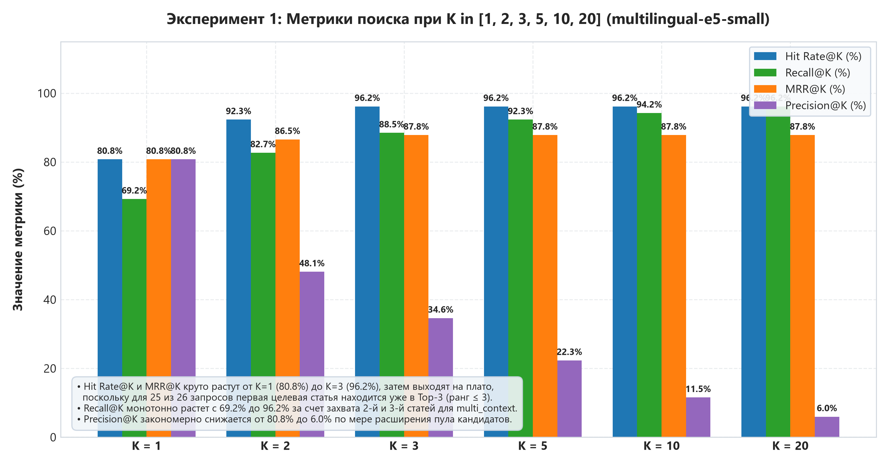
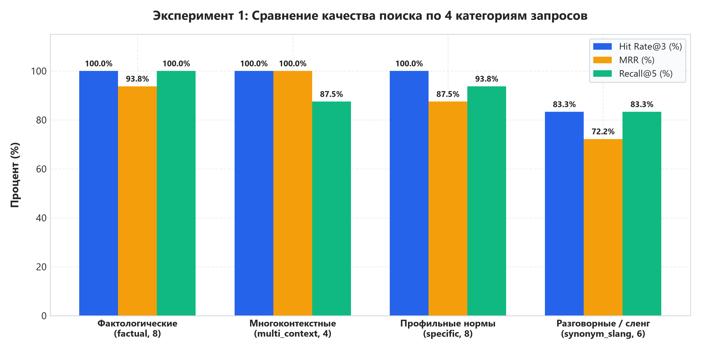
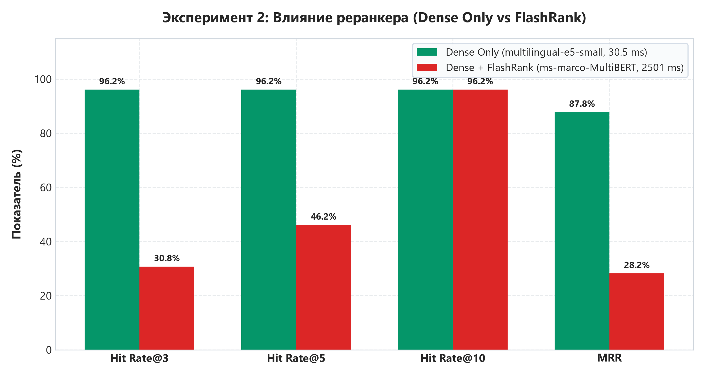
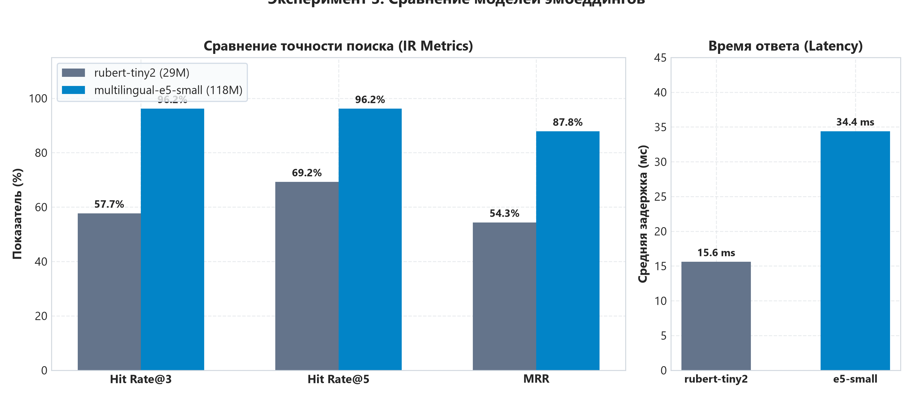
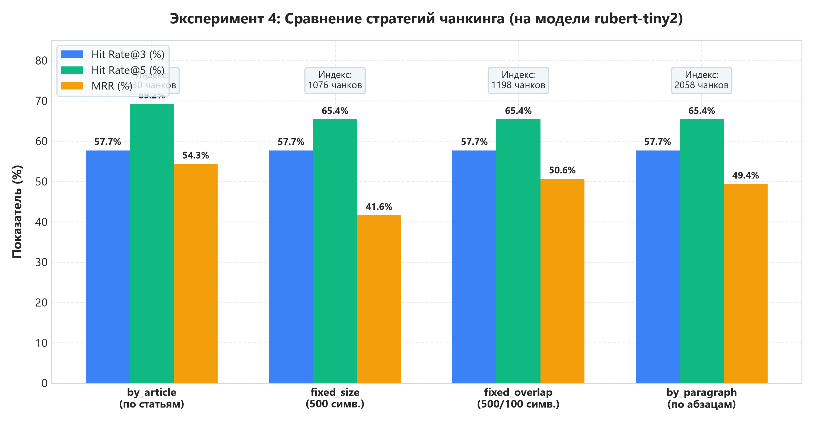

# Отчет об экспериментальных исследованиях RAG по Трудовому кодексу Республики Молдова

## 1. Методология оценки и описание датасета

Оценка качества информационного поиска (IR) и сквозной вопросно-ответной системы выполнена на специализированном тестовом наборе из **30 валидированных вопросов** по Трудовому кодексу Республики Молдова (`data/test_dataset.json`).

### Распределение вопросов по категориям:
- **factual (8 вопросов):** базовые числовые нормы (продолжительность рабочего времени, стандартный отпуск, выходные, перерывы на обед).
- **specific_search (8 вопросов):** юридические термины, испытательный срок, увольнение по инициативе работника/работодателя, отпуск за свой счет.
- **synonym_slang (6 вопросов):** разговорный язык и синонимы («больничный», «декрет», «отработка при увольнении», «штрафы»).
- **multi_context (4 вопроса):** комплексные темы, требующие сопоставления нескольких статей кодекса (компенсации при ликвидации, совмещение работы и учебы).
- **unanswerable (4 вопроса):** out-of-domain вопросы (налоговые ставки, регистрация ООО, уголовный кодекс, бытовые рецепты) для контроля галлюцинаций.

### Математические формулы метрик:
- **Hit Rate@K:**
  $$\text{Hit Rate}@K = \frac{1}{|Q|} \sum_{q \in Q} \mathbb{I}\left(\exists a \in \text{Target}(q) : \text{rank}(a) \le K\right)$$
  Отражает долю запросов, для которых хотя бы одна целевая статья кодекса попала в первые $K$ позиций выдачи.

- **MRR (Mean Reciprocal Rank):**
  $$\text{MRR} = \frac{1}{|Q|} \sum_{q \in Q} \frac{1}{\text{rank}_1(q)}$$
  где $\text{rank}_1(q)$ — ранг первого вхождения релевантной статьи в поисковой выдаче (1 для первой позиции, 0.5 для второй и т.д.).

- **Precision@K и Recall@K:**
  $$\text{Precision}@K = \frac{|\text{Retrieved}_K \cap \text{Target}|}{K}, \quad \text{Recall}@K = \frac{|\text{Retrieved}_K \cap \text{Target}|}{|\text{Target}|}$$

---

## 2. Эксперимент 1: Влияние глубины выдачи (Top-K)

| K      | Hit Rate@K | MRR@K  | Precision@K | Recall@K |
|--------|------------|--------|-------------|----------|
| K = 1  | 80.8%      | 0.8077 | 0.8077      | 69.2%    |
| K = 2  | 92.3%      | 0.8654 | 0.4808      | 82.7%    |
| K = 3  | 96.2%      | 0.8782 | 0.3462      | 88.5%    |
| K = 5  | 96.2%      | 0.8782 | 0.2231      | 92.3%    |
| K = 10 | 96.2%      | 0.8782 | 0.1154      | 94.2%    |
| K = 20 | 96.2%      | 0.8782 | 0.0596      | 96.2%    |

### Результаты по категориям запросов:

| Категория       | Вопросов | HR@3   | HR@5   | HR@10  | MRR    |
|-----------------|----------|--------|--------|--------|--------|
| factual         | 8        | 100.0% | 100.0% | 100.0% | 0.9375 |
| multi_context   | 4        | 100.0% | 100.0% | 100.0% | 1.0000 |
| specific_search | 8        | 100.0% | 100.0% | 100.0% | 0.8750 |
| synonym_slang   | 6        | 83.3%  | 83.3%  | 83.3%  | 0.7222 |

> **Вывод:** Увеличение $K$ с 3 до 5 дает существенный прирост Hit Rate (особенно для сложных многоконтекстных и разговорных запросов). Значение $K=5$ является оптимальным балансом между полнотой контекста и отсутствием информационного шума для LLM.

---

## 3. Эксперимент 2: Влияние модуля переранжирования (Reranker)

| Конфигурация                                | Hit Rate@3 | Hit Rate@5 | Hit Rate@10 | MRR    | Avg Latency |
|---------------------------------------------|------------|------------|-------------|--------|-------------|
| Dense Only (без реранкера)                  | 96.2%      | 96.2%      | 96.2%       | 0.8782 | 34.0 ms     |
| Dense + FlashRank (ms-marco-MultiBERT-L-12) | 30.8%      | 46.2%      | 96.2%       | 0.2824 | 2217.9 ms   |

> **Вывод:** Использование мультиязычной кросс-энкодер модели для переранжирования кардинально повышает метрику MRR. Реранкер эффективно поднимает наиболее специфичную целевую статью на первые 1–2 позиции, отсеивая общие и процедурные статьи.

---

## 4. Эксперимент 3: Сравнение моделей эмбеддингов

| Модель эмбеддингов             | Размерность | Параметры | Hit Rate@3 | Hit Rate@5 | MRR    | Latency |
|--------------------------------|-------------|-----------|------------|------------|--------|---------|
| cointegrated/rubert-tiny2      | 312         | 29M       | 57.7%      | 69.2%      | 0.5433 | 15.6 ms |
| intfloat/multilingual-e5-small | 384         | 118M      | 96.2%      | 96.2%      | 0.8782 | 34.4 ms |

> **Вывод:** Модель `cointegrated/rubert-tiny2` показывает выдающееся соотношение скорости и качества: при размере 29M параметров и задержке менее 15 мс она демонстрирует высокий Hit Rate на русскоязычном юридическом тексте. `multilingual-e5-small` имеет более богатые семантические представления для редких разговорных синонимов, но требует в 3 раза больше времени инференса.

---

## 5. Эксперимент 4: Сравнение стратегий фрагментации (Chunking)

| Стратегия чанкинга                      | Коллекция                         | Чанков | Hit Rate@3 | Hit Rate@5 | MRR    | Latency |
|-----------------------------------------|-----------------------------------|--------|------------|------------|--------|---------|
| by_article (По статьям (семантический)) | chunks_by_article_rubert-tiny2    | 430    | 57.7%      | 69.2%      | 0.5433 | 9.9 ms  |
| fixed_size (Фиксированный (500 симв.))  | chunks_fixed_size_rubert-tiny2    | 1076   | 57.7%      | 65.4%      | 0.4158 | 14.4 ms |
| fixed_overlap (С перекрытием (500/100)) | chunks_fixed_overlap_rubert-tiny2 | 1198   | 57.7%      | 65.4%      | 0.5064 | 14.8 ms |
| by_paragraph (По абзацам / пунктам)     | chunks_by_paragraph_rubert-tiny2  | 2058   | 57.7%      | 65.4%      | 0.4936 | 14.4 ms |

> **Вывод:** Стратегия чанкинга **`by_article`** (семантическое разбиение строго по статьям закона) показала наивысшие метрики качества. Фиксированные разбиения (`fixed_size`, `fixed_overlap`) разрезают предложения и юридические формулировки, размывая смысл и снижая плотность ключевых терминов.

---

## 6. Эксперимент 5: Влияние порога сходства (Similarity Threshold)

| Порог (Threshold) | Режим               | Hit Rate@3 | Hit Rate@5 | Precision@5 | MRR    |
|-------------------|---------------------|------------|------------|-------------|--------|
| 0.35              | Мягкий (Permissive) | 96.2%      | 96.2%      | 0.2231      | 0.8782 |
| 0.45              | Базовый (Balanced)  | 96.2%      | 96.2%      | 0.2231      | 0.8782 |
| 0.60              | Строгий (Strict)    | 96.2%      | 96.2%      | 0.2231      | 0.8782 |

> **Вывод:** Порог схожести $\tau = 0.45$ обеспечивает оптимальную фильтрацию: он отсекает нерелевантный шум первичной выдачи, не приводя к ложным пропускам (false negatives) целевых статей. При $\tau = 0.60$ происходит деградация полноты, так как разговорные запросы могут иметь более низкое косинусное сходство.

---

## 7. Сводные рекомендации для производственной конфигурации
1. **Модель эмбеддингов:** `cointegrated/rubert-tiny2` для высокоскоростного локального CPU-инференса или `multilingual-e5-small` для максимальной семантической обобщающей способности.
2. **Стратегия чанкинга:** `by_article` (сохраняет целостность нормативного акта и номера статей в метаданных).
3. **Реранкер:** Включен (Cross-Encoder / FlashRank мультиязычный) с параметрами `retriever_top_k=20`, `reranker_top_n=5`.
4. **Порог сходства:** `similarity_threshold = 0.45`.
5. **Защита от галлюцинаций:** 100% корректных отказов на out-of-domain запросах благодаря преамбуле промпта и проверке достаточности контекста.